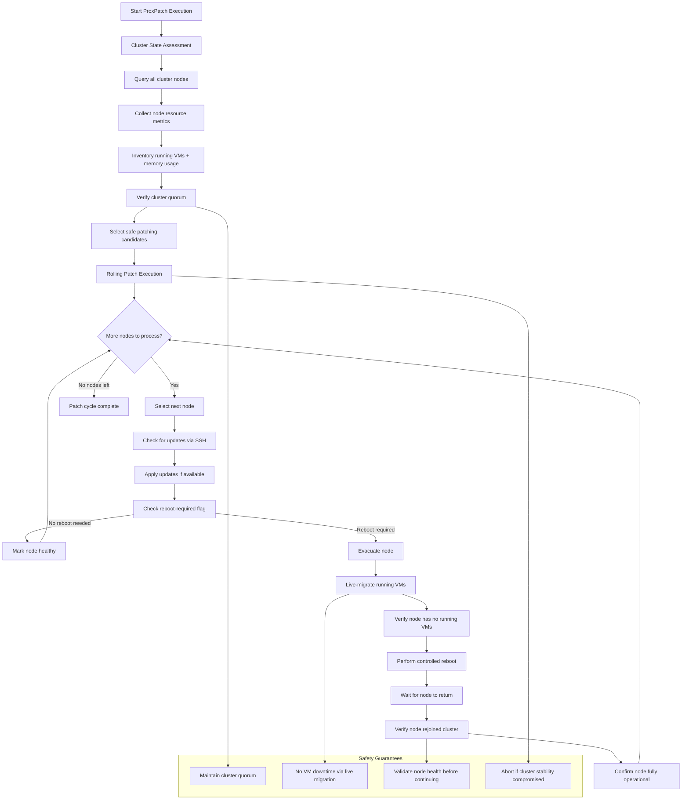

# ProxPatch - An automated rolling patch manager for Proxmox clusters

<br>

<p float="center"></p>

**ProxPatch** (written by [gyptazy](https://gyptazy.com/proxpatch/)) is a lightweight, automation-first patch orchestration tool for Proxmox VE clusters. It performs **rolling security updates** across nodes, safely migrates running VMs, reboots when required, and keeps cluster downtime to a minimum.

The design goal is simple:

    > Patch every node automatically without disrupting running workloads.

## Overview
ProxPatch is a rolling patch orchestration tool for Proxmox VE clusters that automates one of the most repetitive and risk-prone operational tasks: keeping cluster nodes updated without interrupting running workloads.

Instead of manually draining nodes, migrating VMs, applying updates, and rebooting one host at a time, ProxPatch coordinates this process automatically. It inspects the cluster state, upgrades nodes via SSH, determines whether a reboot is required, migrates running guests away from affected nodes, and performs controlled reboots while keeping the cluster operational.

The tool is intentionally minimal and transparent. It does not rely on external orchestration frameworks, databases, or API tokens. By using native Proxmox tooling (`pvesh`, `qm`, SSH) and a clear execution flow, ProxPatch remains easy to audit, predictable in behavior, and suitable for both homelabs and production environments. The initial idea was to implement this into my already exisiting [ProxLB](https://github.com/gyptazy/ProxLB) project which handles DRS alike load balancing of VMs across Proxmox clusters. However, missing API endpoints for patching and rebooting nodes in a rolling fashion made it necessary to implement this as a separate tool (or to always patch the Proxmox API which could lead into additional issues in long-term).

At its core, ProxPatch follows a simple philosophy:

- Prefer safety over speed  
- Avoid unnecessary downtime  
- Keep the cluster running at all times  
- Make automation observable and debuggable  
- Stay lightweight and dependency-free  

ProxPatch is not a full lifecycle manager or HA replacement. Instead, it focuses on one job and does it well: **unattended and fully automated rolling patching of Proxmox nodes with minimal service disruption**.

## Requirements 
ProxPatch is designed to run inside or alongside a Proxmox VE cluster and relies only on native tooling already present on most installations.

* Proxmox VE cluster (tested on 8.x and 9.x)
    * Minimum of three Nodes
    * Cluster must maintain quorum during patching
    * Shared storage (e.g. Ceph, NFS) for live migration
* SSH access to all cluster nodes (passwordless key-based authentication recommended)
* `sudo` Package on all nodes for applying updates and rebooting
* `jq` on the machine running ProxPatch for JSON parsing

## Architecture

### Flow Chart


### Execution Flow
ProxPatch follows a systematic approach to ensure safe and efficient cluster patching:

1. **Cluster State Assessment**
    - Queries all nodes in the cluster and gathers current resource metrics
    - Inventories running VMs and their memory requirements on each node
    - Verifies cluster quorum and identifies safe patching candidates

2. **Rolling Patch Execution**
    - Processes nodes sequentially to maintain cluster stability
    - For each node:
      - Checks for available security and system updates via SSH
      - Applies updates if available
      - Detects if a node reboot is required post-patching
      - If reboot needed:
         - Live-migrates all running VMs to other cluster nodes
         - Performs controlled node reboot
         - Monitors node recovery and cluster rejoin
      - Confirms node is fully operational before proceeding to next node

3. **Safety Guarantees**
    - Maintains cluster quorum throughout the patching cycle
    - Ensures no workload interruption through pre-reboot VM migration
    - Validates node health before processing subsequent nodes
    - Aborts patching if cluster stability is compromised

## Installation

### Debian Repository

```
# Add the official gyptazy.com repository
curl https://git.gyptazy.com/api/packages/gyptazy/debian/repository.key -o /etc/apt/keyrings/gyptazy.asc
echo "deb [signed-by=/etc/apt/keyrings/gyptazy.asc] https://packages.gyptazy.com/api/packages/gyptazy/debian trixie main" | sudo tee -a /etc/apt/sources.list.d/gyptazy.list
apt-get update

# Install ProxPatch
apt-get install -y proxpatch
```

### Debian Packages

You can also download and install the latest Debian package directly from the gyptazy CDN:

* https://cdn.gyptazy.com/debian/proxpatch/

## Configuration
ProxPatch is designed to work out of the box with minimal setup. In most environments, **no configuration is required**.

- ProxPatch only needs to be installed on **one** Proxmox VE node per cluster.
- From that node, it automatically discovers all other nodes in the cluster and orchestrates patching, migrations, and reboots remotely.

By default, ProxPatch uses the authentication and SSH trust that already exists in a standard Proxmox cluster setup:

- Uses the cluster’s existing SSH keys and trust relationships  
- Connects to other nodes as **`root`**  
- Executes:
  - package updates  
  - system upgrades  
  - reboots  
- Automatically gathers all nodes in the cluster  
- No configuration file is required for standard Proxmox installations  

If your cluster was created normally, you can run ProxPatch immediately after installing it.

You can optionally create a configuration file to use a different SSH user instead of `root`:

```yaml /etc/proxpatch/proxpatch.yaml
ssh_user: proxpatch
```

If ssh_user is defined:
* ProxPatch will SSH into other nodes using that user
* All commands will be executed via sudo

The user must have:
* Passwordless sudo privileges
* Be able to SSH to all cluster node

Example suodoers entry for a custom user named `proxpatch`:

```
# Allow proxpatch to run required Proxmox patch commands without password

User_Alias PROXPATCH = proxpatch

Cmnd_Alias PROXPATCH_CMDS = \
    /usr/bin/pvesh create *, \
    /usr/bin/apt-get update, \
    /usr/bin/apt-get dist-upgrade, \
    /usr/bin/apt-get -y dist-upgrade, \
    /usr/sbin/reboot, \
    /sbin/reboot

PROXPATCH ALL=(root) NOPASSWD: PROXPATCH_CMDS
```

## Options
| Setting      | Default  | Required | Description                      |
| ------------ | -------- | -------- | -------------------------------- |
| -d  | None     | No       | Run in debug mode      |
| -c    | None     | No       | Define custom configuration file path    |


## Usage
ProxPatch is designed to run fully automated rolling updates across your Proxmox VE cluster. To begin the rolling upgrade process, simply enable and start the provided systemd unit:

```bash
systemctl enable proxpatch
systemctl start proxpatch
```

> [!CAUTION]
> ProxPatch must run on exactly one node per cluster.
Do not enable or start the proxpatch service on multiple nodes simultaneously.

## Building

## Community & Support

Have questions, ideas, or need help with ProxPatch?  
There are multiple ways to get support and connect with the community.

### Discord

Join our Discord server for real-time discussions, help, and exchange with other users:

- [Join the ProxPatch Discord](https://discord.gg/p9UxdMnx)

This is the fastest way to get feedback or discuss ideas.

### Issues & Feature Requests

If you found a bug, want to request a feature, or suggest an improvement, please open an issue on GitHub:

- [Create or view issues on GitHub](https://github.com/gyptazy/ProxPatch/issues)

When opening an issue, please include:

- Proxmox version  
- ProxPatch version  
- Relevant logs or error messages  
- Steps to reproduce the issue  

Clear and detailed reports help us improve ProxPatch faster and more efficiently.


## Author
* [Florian Paul Azim Hoberg (gyptazy)](https://gyptazy.com/proxpatch/)

## Disclaimer
This software is provided “as is”, without warranty of any kind. Use it at your own risk. The authors and contributors are not liable for any damages resulting from its use.