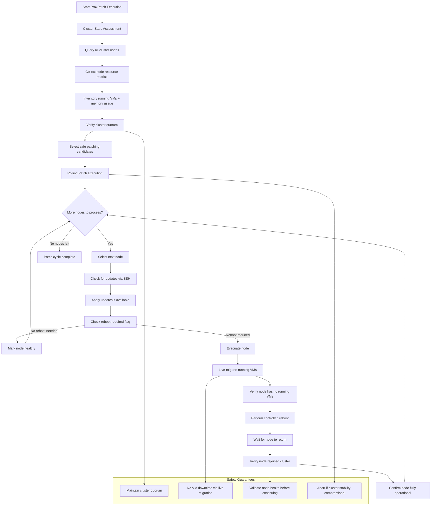

# Architecture

## Flow Chart

## Execution Flow
ProxPatch follows a systematic approach to ensure safe and efficient cluster patching:

1. **Cluster State Assessment**
    - Queries all nodes in the cluster and gathers current resource metrics
    - Inventories running VMs and their memory requirements on each node
    - Verifies cluster quorum and identifies safe patching candidates

2. **Rolling Patch Execution**
    - Processes nodes sequentially to maintain cluster stability
    - For each node:
      - Checks for available security and system updates via SSH
      - Applies updates if available
      - Detects if a node reboot is required post-patching
      - If reboot needed:
         - Live-migrates all running VMs to other cluster nodes
         - Performs controlled node reboot
         - Monitors node recovery and cluster rejoin
      - Confirms node is fully operational before proceeding to next node

3. **Safety Guarantees**
    - Maintains cluster quorum throughout the patching cycle
    - Ensures no workload interruption through pre-reboot VM migration
    - Validates node health before processing subsequent nodes
    - Aborts patching if cluster stability is compromised